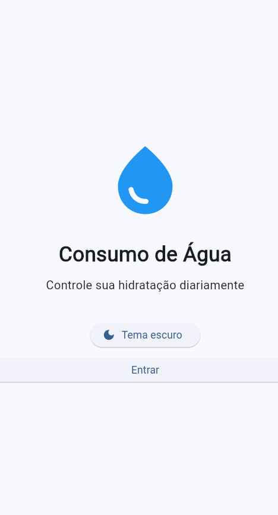
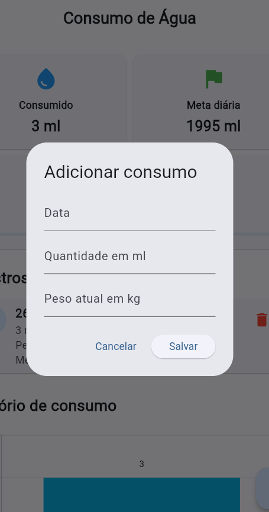
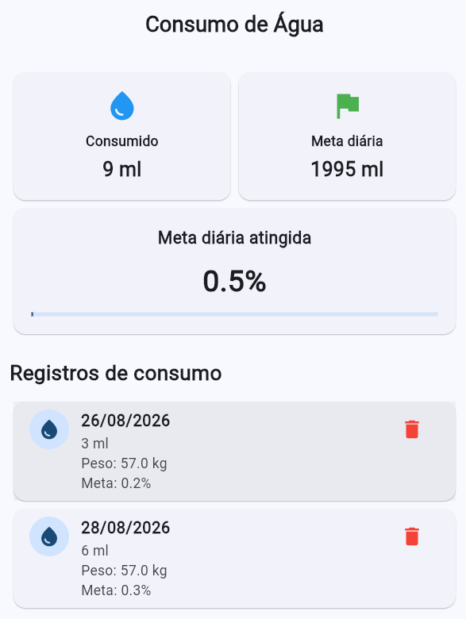
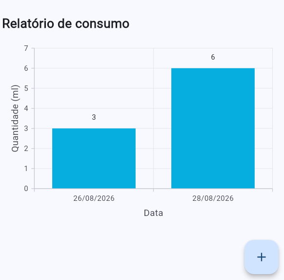

# 💧 Controle de Consumo de Água

Aplicativo desenvolvido para registrar e acompanhar o consumo diário de água, armazenando informações sobre a data, a quantidade de água consumida e o peso atual do usuário.
O aplicativo calcula automaticamente a **porcentagem da meta diária de consumo de água atingida**, utilizando a recomendação média de **35 ml de água por quilograma corporal**.

## 📱 Título do App

**Controle de Consumo de Água**

## 🛠️ Tecnologias

* **Flutter** — desenvolvimento do aplicativo mobile
* **Dart** — linguagem de programação


## 📋 Funcionalidades

* Registrar o consumo de água;
* Informar a data do registro;
* Informar a quantidade de água consumida em mililitros;
* Informar o peso atual em quilogramas;
* Calcular a meta diária de consumo de água;
* Calcular a porcentagem da meta diária atingida;
* Visualizar os registros de consumo;
* Armazenar os dados localmente no dispositivo.

### 💧 Cálculo da meta diária

O aplicativo considera a recomendação média de:

**35 ml × peso corporal (kg)**

Por exemplo:

> Uma pessoa com 60 kg possui uma meta diária estimada de:
>
> **35 × 60 = 2.100 ml**

A porcentagem da meta atingida é calculada através da quantidade consumida em relação à meta diária:

**Porcentagem atingida = (quantidade consumida ÷ meta diária) × 100**

Por exemplo, se a pessoa consumir 1.050 ml:

**(1.050 ÷ 2.100) × 100 = 50%**

## ▶️ Passos para testar

### 1. Clonar o repositório

git clone https://github.com/MIRELLA-02/Consumo-de-gua.git


### 2. Acessar a pasta do projeto

cd nome-do-projeto


### 3. Instalar as dependências

flutter pub get


### 4. Executar o aplicativo

Com um dispositivo físico conectado ou um emulador aberto:


flutter run


### 5. Testar o aplicativo

1. Abrir o aplicativo;
2. Cadastrar um novo registro de consumo;
3. Informar a data;
4. Informar a quantidade de água consumida em ml;
5. Informar o peso atual em kg;
6. Salvar o registro;
7. Verificar a meta diária calculada;
8. Conferir a porcentagem da meta atingida;
9. Consultar os registros armazenados.

## 🖼️ Prints das telas

### Tela inicial



### Cadastro de consumo



### Histórico de consumo



### Relatório de Consumo




## 📦 Arquivo APK

O arquivo `.apk` está disponível na pasta:

```text
assets/
└── app-release.apk
```


## 👩‍💻 Desenvolvimento

Projeto desenvolvido por Mirella Brolezi
